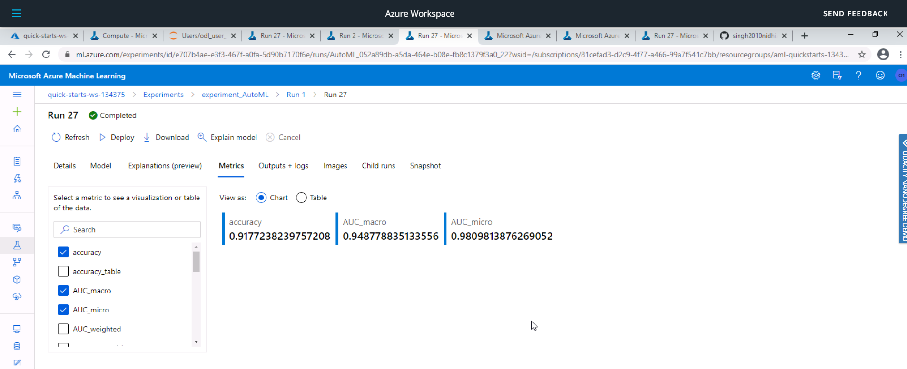
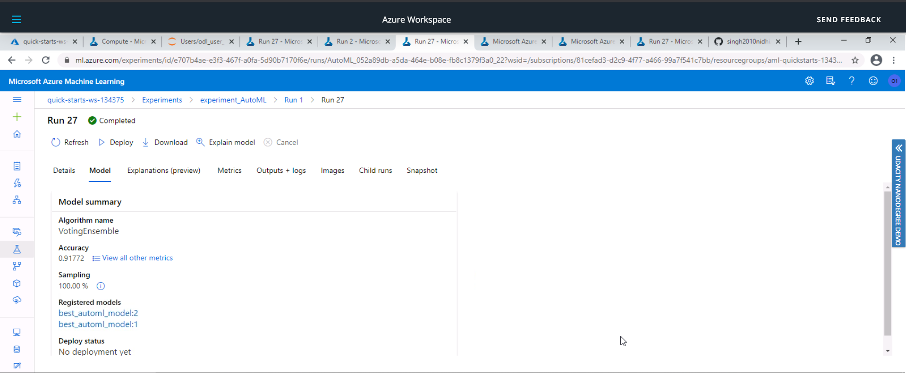

# Optimizing an ML Pipeline in Azure

## Overview

This project is part of the Udacity Azure ML Nanodegree.
In this project, we build and optimize an Azure ML pipeline using the Python SDK and a provided Scikit-learn model.
This model is then compared to an Azure AutoML run.

#### Figure 1: Workflow of the project : ####

## Summary

The Bank Marketing dataset used for this project contains data about bank customers using which we seek to predict whether a customer will subscribe to the fixed term deposit or not. This dataset is related with direct marketing campaigns of a Portuguese banking institution. It contains input attributes such as `age`,  `job`, `marital status`, `education` etc and output attribute `y` which has values yes or no which states whether the client has subscribed to a term deposit or not.

The best performing model was a **Voting Ensemble** model produced by Auto ML run and it had an accuracy of `91.77%`.
 
## Scikit-learn Pipeline

Firstly the data was taken from the UCI Bank Marketing dataset. Then the datset was passed to `clean_data` function in `train.py` file to clean the data and apply one-hot encoding. Then the dataset was split into train and test set. After that the training data was passed to a **Logistic Regression Model**.

The hyperparameters of the logistic regression model such as Inverse of Regularization strength (`C`) and Maximum Number of Iterations (`max_iter`) were tuned using Microsoft Azure Machine Learning's hyperparameter tuning package **HyperDrive**. 

Azure ML supports three types of sampling Random sampling, Grid sampling and Bayesian sampling. 

* Here `RandomParameterSampling` was used as a parameter sampler. In this sampling algorithm, hyperparameter values are randomly selected from the defined search space and supports early termination of low-performance runs thus taking less computational efforts.
* The Grid Sampling performs a simple grid search over all possible values over search space and thus this can be very budget exhaustive.
* Bayesian sampling is based on the Bayesian optimization algorithm. It picks samples based on how previous samples performed, so that new samples improve the primary metric. Thus this method also requires huge number of runs to improve metrics of future samples. So this method is also very compute intensive for our project.

Thus Random Parameter Sampling is best suited for our project.

Azure Machine Learning supports four early termination policies - Bandit policy, Median stopping policy, Truncation selection policy, No termination policy. 

* Bandit policy is based on slack factor/slack amount and evaluation interval. Bandit terminates runs where the primary metric is not within the specified slack factor/slack amount compared to the best performing run.
* Median stopping is an early termination policy based on running averages of primary metrics reported by the runs. This policy computes running averages across all training runs and terminates runs with primary metric values worse than the median of averages.
* Truncation selection policy cancels a percentage of lowest performing runs at each evaluation interval. Runs are compared using the primary metric.
* If no policy is specified, the hyperparameter tuning service will let all training runs execute to completion, i.e the No termination Policy.

Here `BanditPolicy` was used as a stopping policy as Bandit Policy with a smaller allowable slack is the most aggressively compute saving policy.

#### Figure 2 : Azure ML Studio Hyper Drive Run Details - ####

#### Figure 3 : Azure ML Studio Hyper Drive Run Metrics - ####

## AutoML

AutoML is used to automate the repetitive tasks by creating a number of pipelines in parallel that try different algorithms and parameters. This iterates through ML algorithms paired with feature selections, where each iteration produces a model with a training score. The higher the score, the better the model is considered to fit the data. This process terminates when the exit criteria defined in the experiment is satisfied.

The Banking Datset was pre-processed using `clean_data` and the trained on the `AutoMLConfig` with parameters :
`experiment_timeout_minutes`: 30
`task`: classification
`primary_metric`: accuracy
`training_data`: Tabular dataset created from csv data file using TabularDatasetFactory
`compute_target`: compute cluster
`label_column`: y(result)
`n_cross_validations`: 5

In this the **Voting Ensemble** Model performed the best with an accuracy of `91.77%`.

The hyperparameters recommended by the AutoML for VotingEnsemble are:

fit_intercept=True,
intercept_scaling=1,
l1_ratio=None,
max_iter=100,
multi_class='ovr',
n_jobs=1,
penalty='l1',
random_state=None,
solver='saga',
tol=0.0001,
verbose=0,
warm_start=False

#### Figure 4 : Azure ML Studio AutoML Run Details - ####

#### Figure 5 : Azure ML Studio AutoML Run Metrics - ####

#### Figure 6 : Azure ML Studio AutoML Run Meodel - ####

## Pipeline comparison

The accuracy received from the HyperDrive Model was 90.94% whereas the accuracy received from the AutoML model was 91.77% . Thus the AutoML model outperformed our HyperDrive model by difference of 0.83% accuracy. 

This difference of accuracy was mainly because of the architecture of the two algorithms. In the HyperDrive case we fixed the model to be Logistic Regression and went on to select the best hyperparameters by using HyperDrive. Whereas AutoML gave us a lot of flexibility by selecting the model itself from a range of models and tuning its hyperparameters. 

Thus we can use HyperDrive when we know the model and have less time and computation power, and AutoMl can be used to get more accurate model by giving more time and computational power.

## Future work

Some areas of improvement for future experiments are:

* Class balancing - The dataset used for training the model was imbalanced with size of smallest class = 3692 out of 32950 training samples. This imbalanced data can lead to a falsely perceived positive effect of a model's accuracy because the input data has bias towards one class. Thus the training data can be made more balanced to remove this bias.

* Using Deep Learning to get better Accuracy.

* Using different combination of the `C` and `max-iter` values used in the HyperDrive run.

* Increasing the `experiment_timeout_minutes` inthe AutoML run.

* Using different values of `n_cross_validations` in AutoML run.

## Proof of cluster clean up

The compute cluster created can be deleted by running the following code:
`cpu_cluster.delete()`

OR Directly from the Delete option - 

## References

Machine Learning Engineer with Microsoft Azure Program by Udacity 

[HyperDrive Config](https://docs.microsoft.com/en-us/python/api/azureml-train-core/azureml.train.hyperdrive.hyperdriveconfig?view=azure-ml-py)

[Sklearn](https://docs.microsoft.com/en-us/python/api/azureml-train-core/azureml.train.sklearn.sklearn?view=azure-ml-py)

[Hyperparameter Tuning](https://docs.microsoft.com/en-us/azure/machine-learning/how-to-tune-hyperparameters)

[AutoML](https://docs.microsoft.com/en-us/azure/machine-learning/concept-automated-ml)

